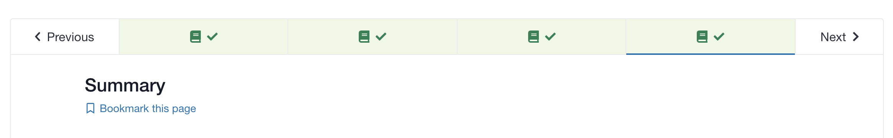

openedx-completion-aggregator
=============================

|pypi-badge| |travis-badge| |codecov-badge| |pyversions-badge| |license-badge|

openedx-completion-aggregator is a Django app that aggregates block level completion data for different block types for Open edX.

What does that mean?

A standard Open edX installation can track the completion of individual XBlocks in a course, which is done using the `completion library <https://github.com/edx/completion#completion>`_. This completion tracking is what powers the green checkmarks shown in the course outline and course navigation as the learner completes each unit in the course:

When completion tracking is enabled (and green checkmarks are showing, as seen above), it is only tracked at the XBlock level. You can use the Course Blocks API to check the completion status of any individual XBlock in the course, for a single user. For example, to get the completion of the XBlock with usage ID ``block-v1:OpenCraft+completion+demo+type@html+block@demo_block`` on the LMS instance ``courses.opencraft.com`` by the user ``MyUsername``, you could call this REST API::

    GET https://courses.opencraft.com/api/courses/v1/blocks/block-v1:OpenCraft+completion+demo+type@html+block@demo_block?username=MyUsername&requested_fields=completion

The response will include a ``completion`` value between ``0`` and ``1``.

However, what if you want to know the overall % completion of an entire course? ("Alex, you have completed 45% of Introduction to Statistics") Or what if you as an instructor want to get a report of how much of Section 1 every student in a course has completed? Those queries are either not possible or too slow using the APIs built in to the LMS and ``completion``.

This Open edX plugin, ``openedx-completion-aggregator`` watches course activity and asynchronously updates database tables with "aggregate" completion data. "Aggregate" data means completion data summed up over all XBlocks into a course and aggregated at higher levels, like the subsection, section, and course level. The completion aggregator provides a REST API that can provide near-instant answers to queries such as:

* What % complete are each of the courses that I'm enrolled in?
* What % of each section in Course X have my students completed?
* What is the average completion % among all enrolled students in a course?

Notes:

* This service only provides data, via a REST API. There is no user interface.
* On production instances, the answers to these "aggregate" questions may be slightly out of date, because they are computed asynchronously (see below). How often they are updated is configurable.

Synchronous vs. Asynchronous calculations
-----------------------------------------

openedx-completion-aggregator operates in one of two modes: synchronous or asynchronous.

With synchronous aggregation, each time a student completes a block, the aggregator code will re-calculate the aggregate completion values immediately. You will always have the freshest results from this API, but at a huge performance cost. Synchronous aggregation is only for development purposes and is not suitable for production. **Synchronous aggregation can cause deadlocks when users complete XBlocks, leading to a partial outage of the LMS. Do not use it on a production site.**

With asynchronous aggregation, the aggregator code will re-calculate the aggregate completion values asynchronously, at periodic intervals (e.g. every hour). How often the update can and should be run depends on many factors - you will have to experiment and find what works best and what is possible for your specific Open edX installation. (Running this too often can clog the celery tasks queue, which might require manual intervention.)

It's important to note that in both modes the single-user, single-course API endpoints will always return up-to-date data. However, data that covers multiple users or multiple courses can be slightly out of date, until the aggregates are updated asynchronously.

API Details
-----------

For details about how the completion aggregator's REST APIs can be used, please refer to `the docstrings in views.py <https://github.com/open-craft/openedx-completion-aggregator/blob/master/completion_aggregator/api/v1/views.py#L24>`_.

Installation and Configuration
------------------------------

openedx-completion-aggregator uses the pluggable django app pattern to ease installation. To use in edx-platform, do the following:

1.  Install the app into your virtualenv::

        $ pip install openedx-completion-aggregator

2.  By default, aggregate data is re-computed synchronously (with each created or updated BlockCompletion). While that is often useful for development, in most production instances, you will want to calculate aggregations asynchronously as explained above. To enable asynchronous calculation for your installation, set the following in your ``lms.yml`` file::

        ...
        COMPLETION_AGGREGATOR_ASYNC_AGGREGATION: true
        ...

    Then configure a pair of cron jobs to run ``./manage.py run_aggregator_service`` and ``./manage.py run_aggregator_cleanup`` as often as desired. (Start with hourly and daily, respectively, if you are unsure.) The ``run_aggregator_service`` task is what updates any aggregate completion data values that need to be updated since it was last run (it will in turn enqueue celery tasks to do the actual updating). The cleanup task deletes old database entries used to coordinate the aggregation updates, and which can build up over time but are no longer needed.

3. If the aggregator is installed on an existing instance, then it's sometimes desirable to fill "Aggregate" data for the existing courses. There is the ``reaggregate_course`` management command, which prepares data that will be aggregated during the next ``run_aggregator_service`` run. However, the process of aggregating data for existing courses can place extremely high loads on both your celery workers and your MySQL database, so on large instances this process must be planned with great care. For starters, we recommend you disable any associated cron jobs, scale up your celery worker pool significantly, and scale up your database cluster and storage.

Design: Technical Details
-------------------------

The completion aggregator is designed to facilitate working with course-level,
chapter-level, and other aggregated percentages of course completion as
represented by the `BlockCompletion model <https://github.com/edx/completion/blob/e1db6a137423f6/completion/models.py#L175>`_ (from the edx-completion djangoapp).
By storing these values in the database, we are able to quickly return
information for all users in a course.

Each type of XBlock (or XModule) is assigned a completion mode of
"Completable", "Aggregator", or "Excluded".

A "completable" block is one that can directly be completed, either by viewing it
on the screen, by submitting a response, or by some custom defined means.  When
completed, a BlockCompletion is created for that user with a value of 1.0
(any value between 0.0 and 1.0 is allowed).  Completable blocks always have a
maximum possible value of 1.0.

An "excluded" block is ignored for the purposes of completion.  It always has
a completion value of 0.0, and a maximum possible value of 0.0.  If an excluded
block has children, those are also ignored for the purposes of completion.

An "aggregator" block is one that contains other blocks.  It cannot be directly
completed, but has an aggregate completion value equal to the sum of the
completion values of its immediate children, and a maximum possible value equal
to the sum of the maximum possible values of its immediate children (1.0 for
completable blocks, 0.0 for excluded blocks, and the calculated maximum for any
contained aggregators).  If an aggregator has a maximum possible value of 0.0,
(either it has no children, or all its children are excluded), it is always
considered complete.

To calculate aggregations for a user, the course graph is retrieved from the
modulestore (using block transformers) to determine which blocks are contained
by each aggregator, and values are summed recursively from the course block on
down.  Values for every node in the whole tree can be calculated in a single
traversal.  These calculations can either be performed "read-only" (to get the
latest data for each user), or "read-write" to store that data in the
`completion_aggregator.Aggregator model <https://github.com/open-craft/openedx-completion-aggregator/blob/a71ab4f077/completion_aggregator/models.py#L199>`_.

During regular course interaction, a learner will calculate aggregations on the
fly to get the latest information.  However, on-the-fly calculations are too
expensive when performed for all users in a course, so periodically (e.g. every
hour, but this is configurable), a task is run to calculate all aggregators that
have gone out of date since the last run, and store those values in the database.
These stored values are then used for reporting on course-wide completion (for
course admin views).

By tracking which blocks have been changed recently (in the `StaleCompletion table <https://github.com/open-craft/openedx-completion-aggregator/blob/a71ab4f077a/completion_aggregator/models.py#L272>`_
), these stored values can also be used to shortcut calculations for
portions of the course graph that are known to be up to date.  If a user has
only completed blocks in chapter 3 of a three-chapter course since the last
time aggregations were stored, there is no need to redo the calculation for
chapter 1 or chapter 2.  The course-level aggregation can just sum the
already-stored values for chapter 1 and chapter 2 with a freshly calculated
value for chapter 3.

Currently, the major bottleneck in these calculations is creating the course
graph for each user.  We are caching the graph locally to speed things up, but
this stresses the memory capabilities of the servers.

License
-------

The code in this repository is licensed under the AGPL 3.0 unless
otherwise noted.

Please see ``LICENSE.txt`` for details.

How To Contribute
-----------------

Contributions are very welcome.

Please read `How To Contribute <https://github.com/edx/edx-platform/blob/master/CONTRIBUTING.rst>`_ for details.

Reporting Security Issues
-------------------------

Please do not report security issues in public. Please email help@opencraft.com.

Getting Help
------------

Have a question about this repository, or about Open edX in general?  Please
refer to this `list of resources`_ if you need any assistance.

.. _list of resources: https://open.edx.org/getting-help

.. |pypi-badge| image:: https://img.shields.io/pypi/v/openedx-completion-aggregator.svg
    :target: https://pypi.python.org/pypi/openedx-completion-aggregator/
    :alt: PyPI

.. |travis-badge| image:: https://travis-ci.org/open-craft/openedx-completion-aggregator.svg?branch=master
    :target: https://travis-ci.org/open-craft/openedx-completion-aggregator
    :alt: Travis

.. |codecov-badge| image:: http://codecov.io/github/edx/openedx-completion-aggregator/coverage.svg?branch=master
    :target: http://codecov.io/github/open-craft/openedx-completion-aggregator?branch=master
    :alt: Codecov

.. |pyversions-badge| image:: https://img.shields.io/pypi/pyversions/openedx-completion-aggregator.svg
    :target: https://pypi.python.org/pypi/openedx-completion-aggregator/
    :alt: Supported Python versions

.. |license-badge| image:: https://img.shields.io/github/license/open-craft/openedx-completion-aggregator.svg
    :target: https://github.com/open-craft/openedx-completion-aggregator/blob/master/LICENSE.txt
    :alt: License
